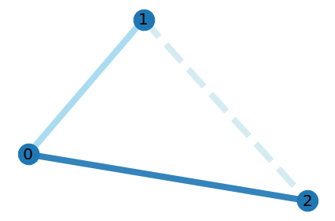
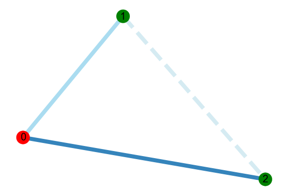
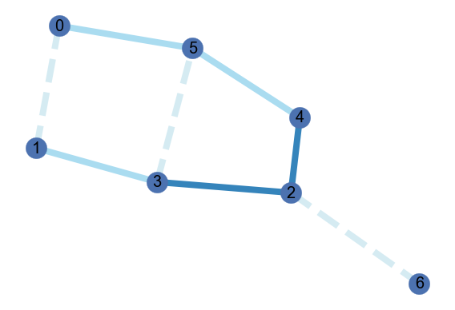
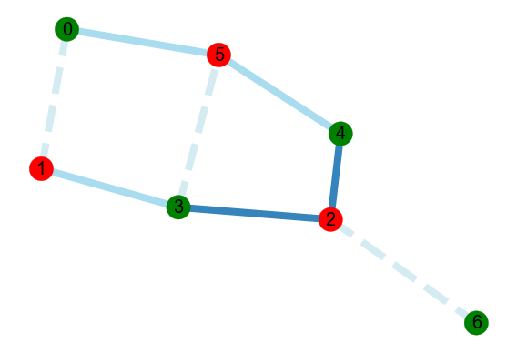

# Generalized QAOA to solve the weighted Max-Cut problem
### If the notebook is failing to load, try this [link](https://nbviewer.jupyter.org/github/Sinestro38/Using-QAOA-to-make-a-generalized-weighted-MaxCut-solver/blob/main/Weighted%20max-cut%20graph.ipynb) to view the notebook on NBViewer

This repository contains a generalized QAOA algorithm that solves MaxCut for both weighted and unweighted graphs. 

But what is the Max-Cut problem? As explained in [here](https://en.wikipedia.org/wiki/Maximum_cut):
> For a graph, a maximum cut is a cut whose size is at least the size of any other cut. That is, it is a partition of the graph's vertices into two complementary sets S and T, such that the number of edges between the set S and the set T is as large as possible. The problem of finding a maximum cut in a graph is known as the Max-Cut Problem. 
The problem can be stated simply as follows. One wants a subset S of the vertex set such that the number of edges between S and the complementary subset is as large as possible. Equivalently, one wants a bipartite subgraph of the graph with as many edges as possible.

This QAOA algorithm will solve a more general version of this problem called weighted Max-Cut, where each edge is associated with a real number, its weight, and the objective is to maximize the total weight of the edges between S and its complement rather than the number of the edges. As it turns out, an equivalent way to formulate this problem is through graph colouring. Instead of partitioning in terms of a cut, one can colour each node black or white (the colours don't matter of course as long as it's binary). Thus, solving for the maximum cut of a graph is equivalent to maximizing the number of edges that end in nodes that have different colourings.

In the notebook, I demonstrate the algorithm on the following weighted graphs:

Graph                                     |  Computed solution
:-------------------------:|:-------------------------:
  |  
  |  

## References
* Fun With Graphs and QAOA (https://lucaman99.github.io/new_blog/2020/mar16.html)
* Quantum Approximate Optimization Algorithm Explained (https://www.mustythoughts.com/quantum-approximate-optimization-algorithm-explained)
* QAOA: Max-Cut (https://quantumai.google/cirq/tutorials/qaoa)
* Quantum approximate optimization algorithm for the Ising Model (https://quantumai.google/cirq/tutorials/educators/qaoa_ising)
* Solving combinatorial optimization problems using QAOA - Qiskit Textbook (https://qiskit.org/textbook/ch-appendix/linear_algebra.html#Matrix-Exponentials)
* QAOA for MaxCut(https://pennylane.ai/qml/demos/tutorial_qaoa_maxcut.html)
