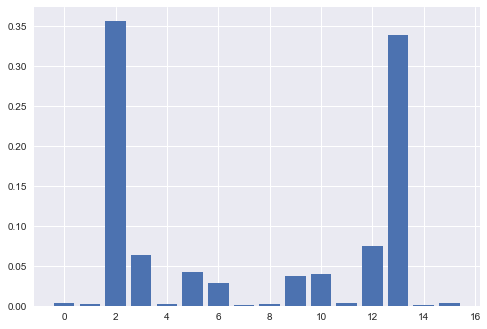

# Using QAOA to solve the weighted max cut problem
Inspired by [Jack Ceroni's QAOA MaxCut implementation](https://lucaman99.github.io/new_blog/2020/mar16.html), I built this algorithm to extend his code to weighted MaxCut graphs as well. This QAOA finds the optimal cut given just the input graph specifications (number of nodes and edges). In the notebook, I demonstrate the algorithm on the following weighted graph:

.png)

After applying the algorithm, we arrive at the probability distribution for the circuit over the optimal parameters:

This algorithm is generalized and can be used to solve any MaxCut problem for a weighted graph, hope you find it useful.
### If the notebook is failing to load, try this [link](https://nbviewer.jupyter.org/github/Sinestro38/Using-QAOA-to-make-a-generalized-weighted-MaxCut-solver/blob/main/Weighted%20max-cut%20graph.ipynb) to view the notebook on NBViewer
